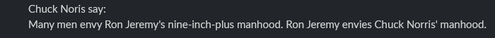

# AmazingBot-Slack
A basic but powerful bot on slack.

## What is it ?
It's a very basic bot slack that I make with https://stardance.hackclub.com/missions/slack-bot/guide but it is funny and cool ! :)

## Features :
Four bot commands with an help commands :
- /amazingbot-ping - Check bot latency

- /amazingbot-hello - Say Hello to the bot !

- /amazingbot-hour - Get the time with this fabulous bot

- /amazingbot-chuck - Get random information on Chuck Noris

## Thank you :
Thank you to Hack Club for this fabulous project !

